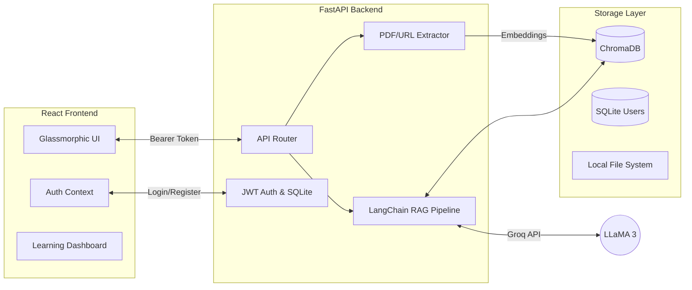

<div align="center">
  <div style="background: linear-gradient(to bottom right, #d946ef, #06b6d4); border-radius: 20px; padding: 20px; display: inline-block; margin-bottom: 20px;">
    <h1 align="center" style="color: white; margin: 0; padding: 0;">✨ DocuMind ✨</h1>
  </div>
  <h3>Intelligent, Secure, AI-Powered Document Analysis</h3>
  <p>DocuMind transforms your static PDFs and web pages into interactive, conversational knowledge bases. Built with an enterprise-grade RAG architecture, complete data isolation, and a stunning glassmorphic UI.</p>
</div>

---

## 🌟 Features

- **🔐 Secure User Authentication:** Full JWT-based login and registration system. Every user gets a completely private, isolated workspace for their documents and vector embeddings.
- **📄 Multi-Format Ingestion:** Seamlessly upload heavy PDF documents or instantly scrape and index any public website URL.
- **🧠 Advanced RAG Engine:** Powered by LangChain, local sentence-transformers, and Groq's blazing-fast inference API (LLaMA-3).
- **🎓 Interactive Learning Dashboard:** DocuMind doesn't just chat—it automatically generates:
  - Executive Summaries
  - Key Topics & Terminology 
  - Interactive Multiple-Choice Quizzes
  - Raw Transcripts
- **📥 PDF Exporting:** Compile your AI-generated Learning Dashboards into beautiful PDF study guides with one click.
- **🎨 Glassmorphic UI:** A state-of-the-art, heavily animated React frontend that feels native and premium.

## 🏗️ Technology Stack

| Category | Technology |
|---|---|
| **Frontend** | React 18, Vite, TailwindCSS, Lucide Icons, html2pdf.js |
| **Backend** | Python, FastAPI, SQLAlchemy, SQLite, python-jose (JWT), passlib/bcrypt |
| **AI & RAG** | LangChain, PyMuPDF (fitz), BeautifulSoup4, HuggingFace (`all-MiniLM-L6-v2`) |
| **Vector DB** | ChromaDB (Persistent, partitioned by User ID) |
| **LLM Provider**| Groq API (`llama3-8b-8192`) |

## 🚀 Architecture



## 💻 Setup & Installation

### 1. Prerequisites
- Python 3.10+
- Node.js 18+
- A Groq API Key (get one [here](https://console.groq.com/keys))

### 2. Backend Setup
Navigate to the root directory and set up the Python environment:
```bash
# Set up virtual environment
python -m venv venv
venv\Scripts\activate  # On Windows

# Install dependencies
pip install -r requirements.txt

# Create .env file and add your Groq API key
echo GROQ_API_KEY=your_key_here > .env

# Navigate to backend and start the server
cd backend
uvicorn main:app --host 127.0.0.1 --port 8000 --reload
```

### 3. Frontend Setup
Open a new terminal window:
```bash
cd frontend

# Install Node dependencies
npm install

# Start the Vite development server
npm run dev
```

Visit `http://localhost:5173` to experience DocuMind!

## 🔒 Security Notice
*For development purposes, the JWT `SECRET_KEY` is hardcoded in the source. Ensure you move this to your `.env` file before deploying to production.*
